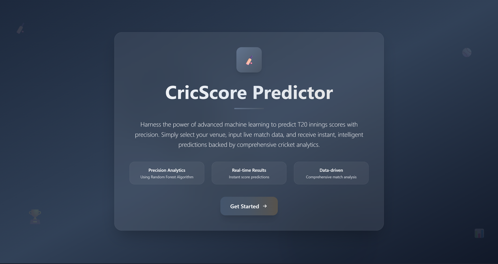
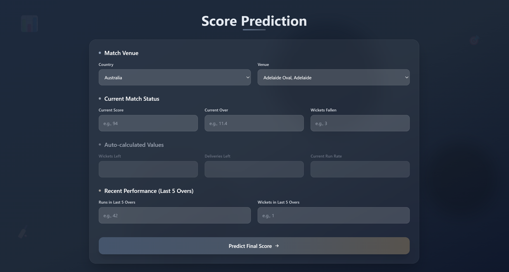
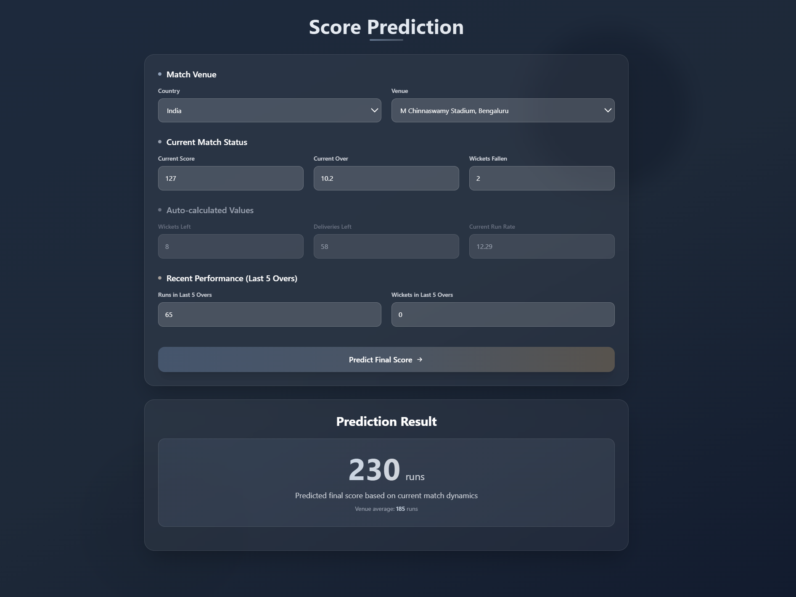

# Cric Score Predictor

Predict the final T20 score of a batting side from an in-progress match using a **Random Forest Regressor**.  
The backend is built with **Flask**, while the model is developed using **scikit-learn, pandas, numpy, matplotlib, and seaborn**.  
The frontend is implemented with **React**.  
The trained model achieves an accuracy of around **92%** on evaluation metrics.

---

## Screenshots
**Main Interface:**


**Score Prediction Result:**



This repository contains:

- `server/` – Flask API that loads the trained model and provides prediction endpoints.
- `client/` – React + Vite UI to enter match state and show predicted score.
- `model/` – Jupyter notebook, dataset and training artifacts used to build the model.
- `artifacts/` – Packaged model and supporting JSON files used by the server.

---

## Quick overview

- The Flask server exposes two endpoints:
  - `POST /predict_score` — predict the final score. Accepts a JSON with match features and returns the predicted final score and venue average.
  - `GET /venues` — returns available venues grouped by country (used by the frontend).

- The React client calls the server to get venues and to request predictions.

---

## Requirements

- Python 3.10+ (server)
- Node.js 18+ and npm (client)
- On Windows PowerShell use the commands shown in the next section.

---

## Server — setup & run

1. Open a terminal and change into the `server` directory:

```powershell
cd "c:\Users\dhruv\OneDrive\Desktop\Cric Score Predictor\server"
````

2. Create and activate a virtual environment (Windows PowerShell):

```powershell
python -m venv venv
.\venv\Scripts\Activate.ps1
```

3. Install dependencies:

```powershell
pip install -r requirements.txt
```

4. Run the API:

```powershell
python app.py
```

By default the Flask server listens on `http://0.0.0.0:5000` (accessible as `http://localhost:5000`).

**Notes:**

* The server expects model artifacts in `server/artifacts/` (see `model` and `artifacts` directories).
* If you move files, update `utils.load_artifacts()` accordingly.

---

## Client — setup & run

1. Change into the `client` directory:

```powershell
cd "c:\Users\dhruv\OneDrive\Desktop\Cric Score Predictor\client"
```

2. Install node packages and run the dev server:

```powershell
npm install
npm run dev
```

The Vite dev server will start (default port 5173). Open the address shown in the terminal (typically `http://localhost:5173`).
Ensure the Flask server is running at `http://localhost:5000` so the client can make API requests.

---

## API details

### POST `/predict_score`

* **Description:** Predict final T20 score.
* **Content-Type:** `application/json`
* **Required JSON fields:**

  * `country` (string)
  * `venue` (string)
  * `delivery_left` (number)
  * `score` (number)
  * `current_run_rate` (number)
  * `wickets_left` (number)
  * `run_in_last5` (number)
  * `wickets_in_last5` (number)
* **Response:** JSON with `predicted_final_score`, `venue_average_score`, and `input_data`.

### GET `/venues`

* **Description:** Returns available venues grouped by country (JSON).

**Example (PowerShell) request:**

```powershell
$body = @{
	country = 'India'
	venue = 'Wankhede'
	delivery_left = 30
	score = 120
	current_run_rate = 8
	wickets_left = 5
	run_in_last5 = 40
	wickets_in_last5 = 1
} | ConvertTo-Json

Invoke-RestMethod -Uri http://localhost:5000/predict_score -Method Post -Body $body -ContentType 'application/json'
```

---

## Model & artifacts

* **Model:** Random Forest Regressor trained using scikit-learn (achieves \~92% accuracy).
* `server/artifacts/cricscore_predictor.pickle` — trained model used to predict final scores.
* `server/artifacts/columns.json` — column ordering or metadata used at prediction time.
* `server/artifacts/venue_avgscore.json` — precomputed average scores per venue and country used as an input feature.

If you want to retrain or inspect the model, see `model/model.ipynb` and the dataset `model/T20 International Dataset.csv`.

---


## Development notes

* The server utilities are in `server/utils.py`.
* The Flask routes are in `server/app.py`.
* Frontend entry: `client/src/main.jsx`, pages/components under `client/src/components/`.

---

## Contributing

Small fixes and improvements are welcome.
For model changes, include training notebooks and updated artifacts.